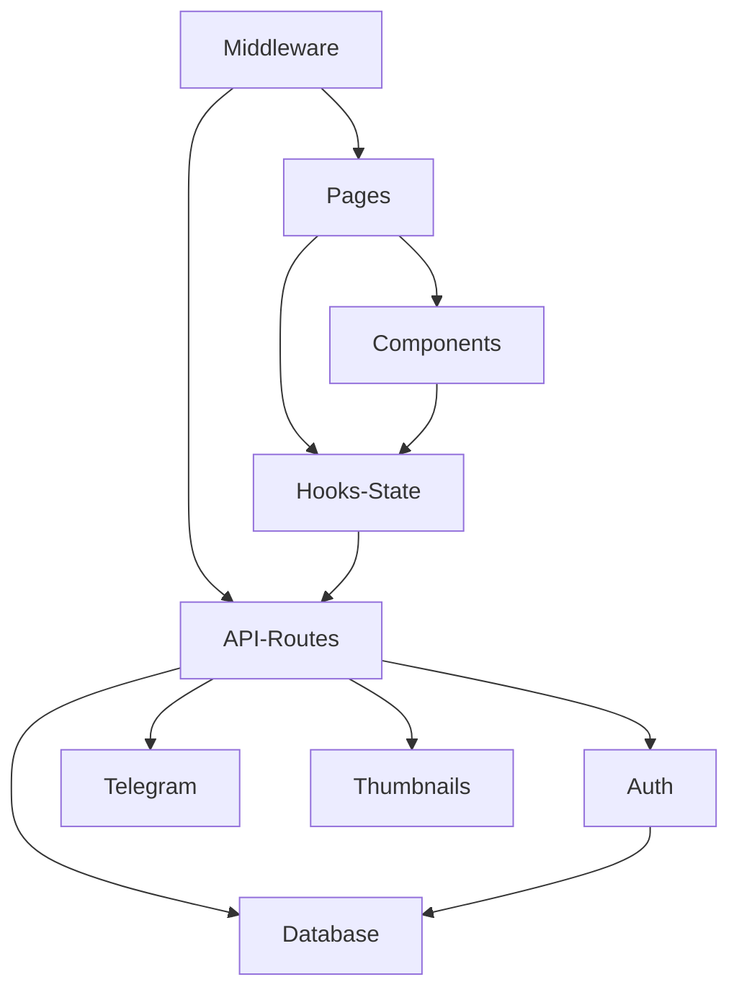

## 1. Stack
- TypeScript, Next.js 16.2.1 (App Router), React 19.2.4 — unlimitade-storage/package.json
- UI: Tailwind CSS 4, shadcn/ui, @base-ui/react, lucide-react, next-themes, sonner
- Data: Prisma 7.5 + @libsql/client (SQLite/LibSQL); state: SWR + Zustand
- Telegram integration: grammy (Bot API), telegram (MTProto, for files >50MB), exifr, sharp (thumbnails)
- Auth: iron-session (encrypted cookie) + Telegram Login Widget (HMAC-SHA256)

## 2. Directory map (2 levels, from REPO_ROOT)
| path | what lives there |
|---|---|
| unlimitade-storage/ | Next.js app — the only manifest/subproject in this repo |
| unlimitade-storage/src/app | App Router pages + API routes (login, drive, photos, favorites, search, api/*) |
| unlimitade-storage/src/components | UI components: auth, layout, files, upload, ui (shadcn) |
| unlimitade-storage/src/hooks | Client hooks: use-files, use-upload, use-session |
| unlimitade-storage/src/lib | Server utilities: db.ts, thumbnails.ts, auth/, telegram/ |
| unlimitade-storage/src/stores | Zustand store: upload-store.ts |
| unlimitade-storage/src/types | Shared TypeScript type definitions |
| unlimitade-storage/prisma | schema.prisma + migrations |
| unlimitade-storage/public | Static assets (logo, icons) |
| unlimitade-storage/scripts | generate-session.mjs (MTProto session generator) |
| Obsidian Vault/ | Pre-existing in-repo docs (not this task's output; separate from VAULT) |
| README.md | Project overview, setup, flows, schema, roadmap |

## 3. Diagram

## 4. Component index
- [[Pages]]
- [[Components]]
- [[API-Routes]]
- [[Middleware]]
- [[Hooks-State]]
- [[Auth]]
- [[Telegram]]
- [[Thumbnails]]
- [[Database]]

## 5. Entry points
- Dev: `npm run dev` (runs `next dev`) from `unlimitade-storage/` — unlimitade-storage/package.json:6
- Prod: `npm run build` then `npm run start` (`next build` / `next start`) from `unlimitade-storage/` — unlimitade-storage/package.json:7-8
- HTTP root: unlimitade-storage/src/app/page.tsx (redirects to `/drive` or `/login` based on session)
- Root layout: unlimitade-storage/src/app/layout.tsx
- Auth gate for all routes: unlimitade-storage/src/middleware.ts

## 6. Conventions (observed)
- Import alias `@/*` used throughout, e.g. `@/lib/auth/session`, `@/components/ui/sonner` — src/app/page.tsx, src/app/layout.tsx
- App Router file convention: `page.tsx` / `layout.tsx` per route folder — src/app/page.tsx, src/app/layout.tsx
- Auth guard centralized in single root `src/middleware.ts`; public paths listed explicitly (`/login`, `/api/auth/telegram`), matcher excludes `_next/*`, static assets, `api/auth`
- Session cookie name `unlimitade-session` checked directly in middleware — src/middleware.ts
- kebab-case filenames for hooks/lib/store modules (use-files.ts, use-upload.ts, upload-store.ts) — README.md Project Structure section
- AGENTS.md (pulled into unlimitade-storage/CLAUDE.md via `@AGENTS.md`) warns: this Next.js version has breaking API changes — consult `node_modules/next/dist/docs/` before writing framework code

## 7. Where things go
- New page/route: add `unlimitade-storage/src/app/<route>/page.tsx` (+ `layout.tsx` if it needs its own shell); add to `publicPaths` in src/middleware.ts if it must bypass auth
- New API endpoint: add `unlimitade-storage/src/app/api/<resource>/route.ts`; call into `src/lib/db.ts` and/or `src/lib/telegram/` as needed
- New/changed DB field: edit `unlimitade-storage/prisma/schema.prisma`, then run `npx prisma generate` and `npx prisma db push` (README.md Getting Started)
- New client data fetch: add a hook under `unlimitade-storage/src/hooks/` following the `use-files.ts` SWR pattern
- New UI piece: place under `unlimitade-storage/src/components/<category>/` matching existing grouping (auth, layout, files, upload, ui)
